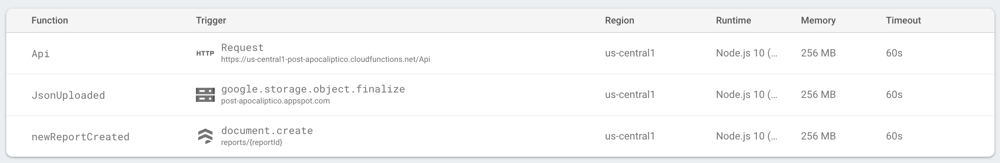

# Firebase Functions - Introduction


# Introduction

 This is a project example of how use Firebase Functions. 
 This example include an interaction between three function listeners:
  - Http triggers
  - Cloud Firestore triggers
  - Cloud Store triggers 

# Requirements

 - Node 8 LTS or Node 10 LTS
 - Git
 - A google account
 
# Configuration

## Install Firebase CLI
 
```bash
npm i -g firebase-tools
```

## Logged in into Firebase
 
```bash
firebase login
```
 
## Clone this repository
 
```bash
git clone https://github.com/caballerojavier13/FirebaseFunctions_FirstSteps.git
```

## Remove the .git folder to make this project your project
  
```bash
rm -rf .git/
```
 
# Change my Firebase project for your own

```bash
firebase use <your_project_id>
```
 
## Start a new git repository
   
```bash
git init
```

## Install the npm dependencies under the `funtions` folder

```bash
cd functions/
npm i
```

# Run locally

```bash
cd functions/
npm run serve
```

# Deploy

```bash
cd functions/
npm run deploy
```


# Documentation

You can find a guide step by step (in spanish) about this project and some concepts [here](https://docs.google.com/document/d/1143PKUVu2SGxpzMCTnXc7f-FrC5CtJqXwrkbrfGA3co/edit?usp=sharing).

# Contact

  - Javier Hernán Caballero García
     - Email: caballerojavier13@gmail.com
     - Web site: [https://javiercaballero.info](https://javiercaballero.info)